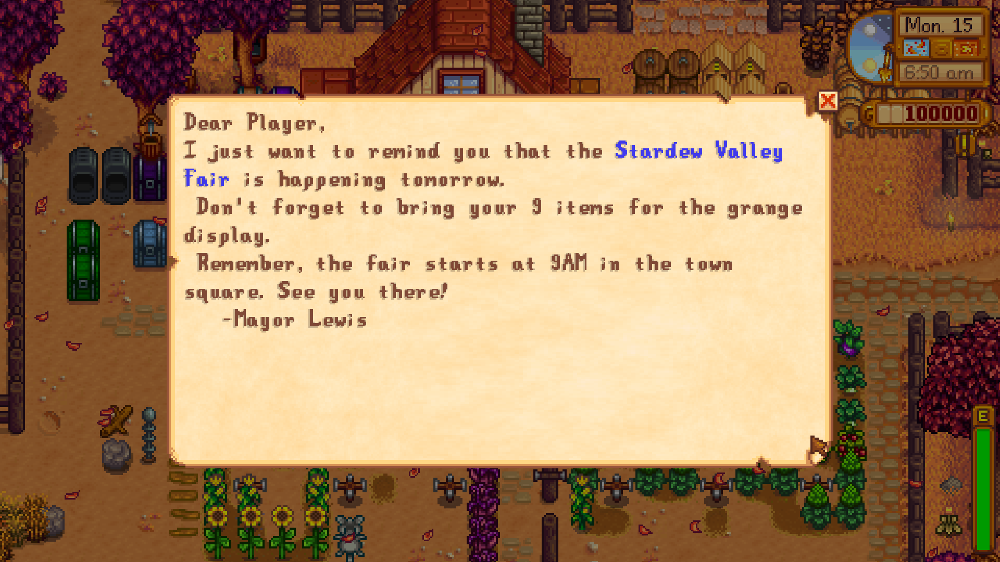

# Mail API Overview

The Mail API of the framework exposes a couple of features modders can use for 
* easier interaction with the game's mail system
* updating the mail content and get feedback on how the player interacted with the mail content
* improving the visual representation of the mail content

Note: Not every feature requires mails to be added to the game via the framework!

## Improve the visual representation of the mail content
The Mail API introduces a **Text Coloring API** to improve the visual representation of a mail's content. This API is available both for mails 
added via the framework and mails added via other framework, such as [Content Patcher](https://github.com/Pathoschild/StardewMods/tree/develop/ContentPatcher).

The Text Coloring API provides a Markup-language based syntax to be used together with the actual mail content and thus requires no programming skills 
or special compatibility by the used frameworks to add mails to the game.

### Syntax

To color a string, use the `<color></color>` tags around the text you want to color. See the following example:
```
<color=COLOR_VALUE>some text</color>
```
The string "some text" will be rendered with the color specified by `COLOR_VALUE`. The Text Coloring API only works with colors specified in 
the **hexadecimal format**.  A hexadecimal color is specified with `#RRGGBB`, where the RR (red), GG (green) and BB (blue) hexadecimal integers 
specify the components of the color. All values (RR, GG, BB) must be between 00 (lowest value) and FF (highest value). Note: The API is 
case-insensitive so you can also use lower-case for the relevant hexadecimal integers.

If we want to color the above text "some text" in red, we thus have to write:
```
<color=#FF0000>some text</color>
```

Every mail content can contain zero or more `<color></color>` pairs. If a mail content is not enclosed by such a pair, the game's default 
text color for the given mail context (mail background,...) will be used for this content. You can have multiple `<color></color>` 
tags side-by-side and you can even use nested `<color>` start tags (`<color>` tags enclosed by other `<color>` tags).

A valid text-coloring syntax thus is defined as following:
```
...<color=#[A-Za-z0-9]{6}>...</color>...
```
where the three dots `...` can stand for otional text and `<color></color>` tags.

### Examples

Below are a couple of examples showcasing different levels of complexity in the use of this API and how they will look in the actual game.

Example 1:
```
"Tomorrow we will all meet at the <color=#0000FF">Town Center</color> to celebrate the end of harvest season!"
```


Example 2:
```
"Some <color=#FF0000>red</color>, some <color=#00FF00>green</color> and some <color=#0000FF>blue</color>."
```


Example 3:
```
"<color=#000000>Some small <color=#C47902>light source</color> surrounded by darkness.</color>"
```


And below is a personal favorite of mine:
```
"A colorful <color=#FF0000>R</color><color=#FF7F00>A</color><color=#FFFF00>I</color><color=#00FF00>N</color>"<color=#0000FF>B</color><color=#3F00FF>O</color><color=#7F00FF>W</color> in a letter."
```


### How to use the API in other mod frameworks?

Below is an example how to use the Text Coloring API in Content Patcher by editing the content of an already existing mail (applying the 
API to a new custom mail will work in the same way):

Create the following content.json file (based on CP 1.9 which was the most recent CP version available at the time of this writing):
```js
{
   "Format": "1.9",
   "Changes": [
    {
      "Action": "EditData",
      "Target": "Data/Mail",
      "Entries": {
        "fall_15": "Dear @,^I just want to remind you that the <color=#0000FF>Stardew Valley Fair</color> is happening tomorrow.^ Don't forget to bring your 9 items for the grange display.^ Remember, the fair starts at 9AM in the town square. See you there!^   -Mayor Lewis"
      }
    }
   ]
}
```
As you can see, we enclosed the words "Stardew Valley Fair" with `<color=#0000FF></color>`. This will result in the following mail content when a player named "Player" will open the mail with the ID "fall_15":



As simple as that!
