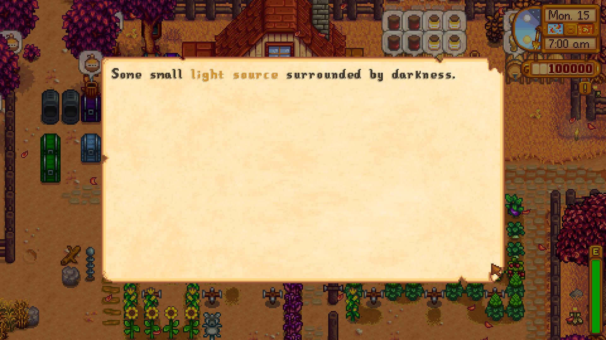
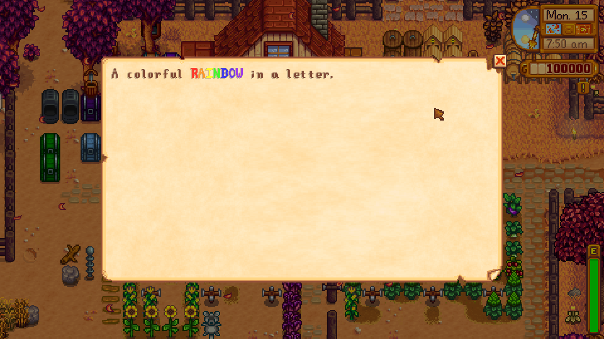

# Mail API Overview

The Mail API of the framework exposes a couple of features modders can use:
* Easy and powerful way to add mails to the game
* updating the mail content and get feedback on how the player interacted with the mail content
* More visualization options for the mail's textual content

Note: Not every feature requires mails to be added to the game via the framework!

## Easy and powerful way to add mails to the game
The Mail API provides an easy way to add mails to the game _uniquely_ for each mod. That way you don't have to worry about mail ID conflicts between different mods. All currently available in-game mail types can be added to the game. Let's take a first look at code adding a mail to the game.
```cs
private void AddMail()
{
   // Obtain an exclusive mail service for this mod.
   IMailService mailService = ServiceFactory.GetFactory("YourModID").GetMailService();

   // Create a mail to send to the player. Here we create a mail some textual content and an attached axe.
   var mail = new ItemMail("MyItemMail", "Some textual content", new Axe());

   // Send the mail to the player. It will arrive in the player's mailbox at the beginning of the next day. 
   mailService.AddMail(mail, 1 /* mail for tomorrow */);
}
```
Let's dissect the code and talk about the different parts in more detail.

First off, obtain an ```IMailService``` instance unique to your mod. 
```cs
IMailService mailService = ServiceFactory.GetFactory("YourModID").GetMailService();
```
We will use this instance to add mails to the game in a mod-isolated way, that is multiple mods can add mails with the _same_ ID to the game 
without the risk of conflicts.

Next, we create an instance of the mail we want to send to the player.
```cs
var mail = new ItemMail("MyItemMailID", "Some text content", new Axe());
```
Here, we create an instance of an ```ItemMail```. ```MyItemMailID``` is the ID of our mail, ```Some text content``` is the text content of the mail and ```new Axe()``` is the attached item to the mail.

Finally, we tell our previously obtained mail service to add the mail to the game.
```cs
mailService.AddMail(mail, 1 /* mail for tomorrow */);
```
With the above line, we specify that our above created item mail will arrive in the player's mailbox in the morning of the next day.

Given this brief overview, let's now take a closer look at the supported mail types and how to send mails for specific days.

### Supported Items

#### Plain text mail
To create a mail with only text, use:
```cs
public Mail(string id, string text)
```
where ```id``` is the ID of the mail and ```text``` is the text content of the mail.

#### Item mail
To create a mail with both text and attached items, use:
```cs
public ItemMail(string id, string text, Item item)
```
where ```id``` is the ID of the mail, ```text``` is the text content of the mail and ```item``` is the attached item of the mail.
-or-
```cs
public ItemMail(string id, string text, IList<Item> items)
```
where ```id``` is the ID of the mail, ```text``` is the text content of the mail and ```items``` is a list of the attached items of a mail.

#### Money mail
To create a mail with both text and attached money, use:
```cs
public MoneyMail(string id, string text, int attachedMoney)
```
where ```id``` is the ID of the mail, ```text``` is the text content of the mail and ```attachedMoney``` is the attached money of the mail. 
The money is recceived by the player upon opening the mail.

#### Recipe mail
To create a mail with both text and an attached recipe, use:
```cs
public RecipeMail(string id, string text, string recipeName, RecipeType recipeType)
```
where ```id``` is the ID of the mail, ```text``` is the text content of the mail, ```recipeName``` is the name of the attached recipe and 
```recipeType``` is one of the following values:
```cs
public enum RecipeType
{
  /// <summary>A cooking recipe.</summary>
  Cooking = 0,
  /// <summary>A crafting recipe.</summary>
  Crafting
}
```

#### Quest mail
To create a mail with both text and an attached quest, use:
```cs
public QuestMail(string id, string text, int questId, bool isAutomaticallyAccepted = false)
```
where ```id``` is the ID of the mail, ```text``` is the text content of the mail, ```questId``` is the ID of the attached quest and 
```isAutomaticallyAccepted``` an indicator if the quest is automatically accepted or requires manual acception by the player.

Now let's take a closer look at how to add mails to the game:
```cs
public void AddMail(Mail mail, int daysFromNow)
```
- or -
```cs
using StardewModdingAPI.Utilities;

public void AddMail(Mail mail, SDate arrivalDay)
```
where ```mail``` is one of the mail types from above and ```daysFromNow``` and ```arrivalDay``` specify the in-game day when the mail will be added to the player's mailbox. Valid values for either of them are a value specifying the current day or a value specifying any day in the future. If the current day is specified (either ```daysFromNow = 0``` or ```arrivalDay = SDate.Now()```) the specified mail instantly arrives in the player's mailbox. Otherwise, the mail will arrive in the morning of the specified day.

## More visualization options for the mail's textual content
The Mail API introduces a **Text Coloring API** to improve the visual representation of a mail's content. This API is available both for mails added via the framework and mails added via other frameworks, such as [Content Patcher](https://github.com/Pathoschild/StardewMods/tree/develop/ContentPatcher).

The Text Coloring API provides a Markup-language based syntax to be used together with the actual mail content and thus requires no programming skills or special compatibility by the used frameworks to add mails to the game.

### Syntax

Enclose the text you want to color with the `<color></color>` tags. See the following example:
```
<color=COLOR_VALUE>some text</color>
```
The string "some text" will be rendered with the color specified by `COLOR_VALUE`. Color values can be specified using the following color representations:
1. A hexadecimal color-code specified as `#RRGGBB`, where the RR (red), GG (green) and BB (blue) hexadecimal integers specify the components of the color. All values must be between 00 (lowest value) and FF (highest value) and the values are *case-insensitive*.
2. A HTML color name. See [this color table](https://htmlcolorcodes.com/color-names/) for a list of all valid color names. Names are *case-insensitive*.

If we want to color the above text "some text" in red, we thus can write it as follows:
```
<color=#FF0000>some text</color>
``` 
-or- 
```
<color=Red>some text</color>
```

Note: Any leading, trailing or inner white-space characters in `COLOR_VALUE` will be ingored.

Every mail content can contain zero or more `<color></color>` tag pairs. Any mail content which is not enclosed by such a pair, will be 
colored in the game's default text color (based on the mail background). You can have multiple `<color></color>` tags side-by-side and you can even use nested `<color>` start tags (`<color>` tags inside other `<color>` tags).

A valid text-coloring syntax thus is defined as the following (instead of a color value in the format `#[A-Fa-f0-9]{6}` a HTML color name can also be used):
```
...<color=#[A-Fa-f0-9]{6}>...</color>...
```
where the three dots `...` can stand for optional text and `<color></color>` tags. If an invalid color value is specified, the default text color will be used (typically the in-game default text color). If there is a mismatch between the color start tags and the color end tags, the text will not be displayed correctly.

### Examples

Below are a couple of examples showcasing different levels of complexity in the use of this API and how they will look in the actual game.

Example 1:
```
"Tomorrow we will all meet at the <color=#0000FF">Town Center</color> to celebrate the end of harvest season!"
```


Example 2:
```
"Some <color=#FF0000>red</color>, some <color=Green>green</color> and some <color=#0000FF>blue</color>."
```


Example 3:
```
"<color=#000000>Some small <color=#C47902>light source</color> surrounded by darkness.</color>"
```


And below is a personal favorite of mine:
```
"A colorful <color=#FF0000>R</color><color=#FF7F00>A</color><color=#FFFF00>I</color><color=#00FF00>N</color>"<color=#0000FF>B</color><color=#3F00FF>O</color><color=#7F00FF>W</color> in a letter."
```


### How to use the API in other mod frameworks?

Below is an example how to use the Text Coloring API in Content Patcher by editing the content of an already existing mail (applying the 
API to a new custom mail will work in the same way):

Create the following content.json file (based on CP 1.9 which was the most recent CP version available at the time of this writing):
```js
{
   "Format": "1.9",
   "Changes": [
    {
      "Action": "EditData",
      "Target": "Data/Mail",
      "Entries": {
        "fall_15": "Dear @,^I just want to remind you that the <color=#0000FF>Stardew Valley Fair</color> is happening tomorrow.^ Don't forget to bring your 9 items for the grange display.^ Remember, the fair starts at 9AM in the town square. See you there!^   -Mayor Lewis"
      }
    }
   ]
}
```
As you can see, we enclosed the words "Stardew Valley Fair" with `<color=#0000FF></color>`. This will result in the following mail content when a player named "Player" will open the mail with the ID "fall_15":


As simple as that!
